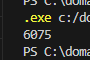
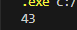
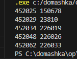

# Задание 1
Настя составляет 6-буквенные коды из букв Н, А, С, Т, Я. Каждая допустимая гласная буква может входить в код не более одного раза. Сколько кодов может составить Настя?
## Описание
Посчитала, сколько кодов может составить Настя, используя гласные буквы не более 1 раза.
## Решение
```
len = "НАСТЯ"
count = 0
for l1 in len:
    for l2 in len:
        for l3 in len:
            for l4 in len:
                for l5 in len:
                    for l6 in len:
                        x = l1 + l2 + l3 + l4 +l5 + l6
                        if x.count("А") <= 1 and x.count("Я") <= 1:
                            count += 1
print(count)
```
## Скриншот

# Задание 2
Значение арифметического выражения $16^{18} * 4^{10} - 46 - 16$ записали в системе счисления с основанием 4. Сколько цифр 3 содержится в этой записи?
## Описание
Посчитала, сколько цифр "3" содержится в числе.
## Решение
```
x = 16**18 * 4**10 - 46 - 16
s =''
while x!= 0:
    s += str(x % 4)
    x //= 4
s = s[::-1]
print(s.count("3"))
```
## Скриншот

# Задание 3
Пусть 
M  — сумма минимального и максимального натуральных делителей целого числа, не считая единицы и самого числа. Если таких делителей у числа нет, то считаем значение M равным нулю. Найдите целые числа, большие 452 021, в порядке возрастания, такие, для которых значение 
M при делении на 7 даёт в остатке 3. Вывести первые 5 найденных чисел и соответствующие им значения M.
## Описание
Создала функцию, которая считает сумму минимального и максимального делителей.
## Решение
```
def F(n): 
    for i in range(2, int(n ** 0.5) + 1):
        if n % i == 0:
            return i + n // i
    return 0
k = 0
for i in range(452021 + 1, 10000000000000):
    if F(i) % 7 == 3:
        print(i, F(i))
        k += 1
    if k == 5: 
        break
```
## Скриншот

