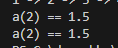
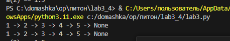

### Задание 1
Напишите две функции для решения задач своего варианта - с использованием рекурсии и без.
## Описание
Написана функция для преобразования вложенных списков в строку. Без рекурсии и глобальных переменных.
## Решение
``` python
def to_str_recursive(lst):
    elements = []
    
    def helper(sublist):
        for item in sublist:
            if isinstance(item, list):
                helper(item)
            else:
                elements.append(str(item))
    
    helper(lst)
    return ' -> '.join(elements) + ' -> None'

print(to_str_recursive([1, [2, [3, [4, [5]]]]]))  

def to_str(lst):
    elements = []
    stack = [lst]
    
    while stack:
        current = stack.pop()
        for item in reversed(current):
            if isinstance(item, list):
                stack.append(item)
            else:
                elements.append(str(item))
    
    return ' -> '.join(elements) + ' -> None'

print(to_str([1, [2, [3, [4, [5]]]]])) 
```
## Скриншот

### Задание 2
Написана функция для расчёта элемента последовательности. С рекурсией и без глобальных переменных.
## Решение
``` python
def req(i):
    if i == 0 or i == 1:
        return 1
    return req(i - 2) + (req(i - 1) / (2 ** (i - 1)))
print(f'a(2) == {req(2)}')

def no_req(i):
    if i == 0 or i == 1:
        return 1
    a1=1
    a2=1
    for n in range(2,i+1):
        current=a1+(a2/(2**(n-1)))
        a1=a2
        a2=current
    return a2

print(f'a(2) == {no_req(2)}')
```
## Скриншот

## Список используемых источников
1.[Самоучитель по Python для начинающих. Часть 13: Рекурсивные функции](https://proglib.io/p/samouchitel-po-python-dlya-nachinayushchih-chast-13-rekursivnye-funkcii-2023-01-23)\
2.[Как работает рекурсия – объяснение в блок-схемах и видео](https://habr.com/ru/articles/337030/)\
3.[Recursion in Programming - Full Course - freeCodeCamp.org](https://www.youtube.com/watch?v=IJDJ0kBx2LM)
