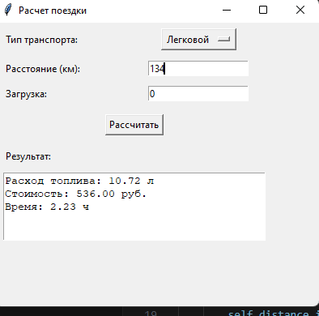

# Задание
По своему варианту задания создайте пакет, содержащий 3 модуля, и подключите его к основной программе.
Основная программа должна предоставлять:
графический пользовательский интерфейс с возможностями ввода требуемых параметров и отображения результатов расчёта.
## Описание
Написала код для расчёта топлива автомобиля, в зависимости от загурзки, расчёт стоимости и времени поездки. Используя Фреймворк Tkinter.
## Решение
```python

class Bus:
    def __init__(self, fuel_consumption_per_100km, fuel_price, passenger_capacity):
        self.fuel_consumption_per_100km = fuel_consumption_per_100km
        self.fuel_price = fuel_price
        self.passenger_capacity = passenger_capacity

    def calculate_fuel_consumption(self, distance, passengers):
        # Увеличиваем расход топлива на 5% за каждые 10 пассажиров
        adjusted_consumption = self.fuel_consumption_per_100km * (1 + (passengers / self.passenger_capacity) * 0.05)
        return (distance / 100) * adjusted_consumption

    def calculate_trip_cost(self, distance, passengers):
        fuel_consumed = self.calculate_fuel_consumption(distance, passengers)
        return fuel_consumed * self.fuel_price

    def calculate_trip_time(self, distance, average_speed):
        return distance / average_speed

class Car:
    def __init__(self, fuel_consumption_per_100km, fuel_price):
        self.fuel_consumption_per_100km = fuel_consumption_per_100km
        self.fuel_price = fuel_price

    def calculate_fuel_consumption(self, distance):
        return (distance / 100) * self.fuel_consumption_per_100km

    def calculate_trip_cost(self, distance):
        fuel_consumed = self.calculate_fuel_consumption(distance)
        return fuel_consumed * self.fuel_price

    def calculate_trip_time(self, distance, average_speed):
        return distance / average_speed

class Truck:
    def __init__(self, fuel_consumption_per_100km, fuel_price, load_capacity):
        self.fuel_consumption_per_100km = fuel_consumption_per_100km
        self.fuel_price = fuel_price
        self.load_capacity = load_capacity

    def calculate_fuel_consumption(self, distance, load):
        # Увеличиваем расход топлива на 10% за каждую тонну загрузки
        adjusted_consumption = self.fuel_consumption_per_100km * (1 + (load / self.load_capacity) * 0.1)
        return (distance / 100) * adjusted_consumption

    def calculate_trip_cost(self, distance, load):
        fuel_consumed = self.calculate_fuel_consumption(distance, load)
        return fuel_consumed * self.fuel_price

    def calculate_trip_time(self, distance, average_speed):
        return distance / average_speed

import tkinter as tk
from tkinter import messagebox
from vehicles_package.car import Car
from vehicles_package.truck import Truck
from vehicles_package.bus import Bus

class VehicleApp:
    def __init__(self, root):
        self.root = root
        self.root.title("Расчет поездки")
        self.root.geometry("400x350")

        # Элементы интерфейса
        tk.Label(root, text="Тип транспорта:").grid(row=0, column=0, sticky="w", padx=10, pady=5)
        self.vehicle_type = tk.StringVar(value="Легковой")
        tk.OptionMenu(root, self.vehicle_type, "Легковой", "Грузовой", "Пассажирский").grid(row=0, column=1, padx=10, pady=5)

        tk.Label(root, text="Расстояние (км):").grid(row=1, column=0, sticky="w", padx=10, pady=5)
        self.distance_input = tk.Entry(root)
        self.distance_input.grid(row=1, column=1, padx=10, pady=5)

        tk.Label(root, text="Загрузка:").grid(row=2, column=0, sticky="w", padx=10, pady=5)
        self.load_input = tk.Entry(root)
        self.load_input.grid(row=2, column=1, padx=10, pady=5)

        tk.Button(root, text="Рассчитать", command=self.calculate).grid(row=3, column=0, columnspan=2, pady=10)

        tk.Label(root, text="Результат:").grid(row=4, column=0, sticky="w", padx=10, pady=5)
        self.result_text = tk.Text(root, height=5, width=40)
        self.result_text.grid(row=5, column=0, columnspan=2, padx=10, pady=5)

    def calculate(self):
        try:
            vehicle_type = self.vehicle_type.get()
            distance = float(self.distance_input.get())
            load = float(self.load_input.get())

            if vehicle_type == "Легковой":
                vehicle = Car(fuel_consumption_per_100km=8, fuel_price=50)
                fuel = vehicle.calculate_fuel_consumption(distance)
                cost = vehicle.calculate_trip_cost(distance)
                time = vehicle.calculate_trip_time(distance, average_speed=60)
            elif vehicle_type == "Грузовой":
                vehicle = Truck(fuel_consumption_per_100km=15, fuel_price=50, load_capacity=10)
                fuel = vehicle.calculate_fuel_consumption(distance, load)
                cost = vehicle.calculate_trip_cost(distance, load)
                time = vehicle.calculate_trip_time(distance, average_speed=50)
            elif vehicle_type == "Пассажирский":
                vehicle = Bus(fuel_consumption_per_100km=12, fuel_price=50, passenger_capacity=50)
                fuel = vehicle.calculate_fuel_consumption(distance, load)
                cost = vehicle.calculate_trip_cost(distance, load)
                time = vehicle.calculate_trip_time(distance, average_speed=60)
            else:
                raise ValueError("Выберите тип транспорта.")

            result = f"Расход топлива: {fuel:.2f} л\nСтоимость: {cost:.2f} руб.\nВремя: {time:.2f} ч"
            self.result_text.delete(1.0, tk.END)
            self.result_text.insert(tk.END, result)
        except Exception as e:
            messagebox.showerror("Ошибка", str(e))

if __name__ == "__main__":
    root = tk.Tk()
    app = VehicleApp(root)
    root.mainloop()
```
## Скриншот

## Список литературы
[Руководство по Tkinter](https://metanit.com/python/tkinter/)
[chatgpt](https://chatgpt.com/)
